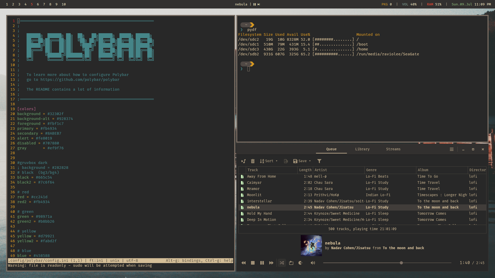

# Arch linux i3 pc setup

---

## info
- status bar - [polybar](https://github.com/polybar/polybar)
- notification daemon - [dunst](https://github.com/dunst-project/dunst)
- app launcher - [rofi](https://github.com/davatorium/rofi)
- make prompt pretty - [starship](https://starship.rs/)
- terminal - [kitty](https://sw.kovidgoyal.net/kitty/)
- music player daemon - [mpd](https://wiki.archlinux.org/title/Music_Player_Daemon)
---

the mix of boredome and procrastination is crazy
